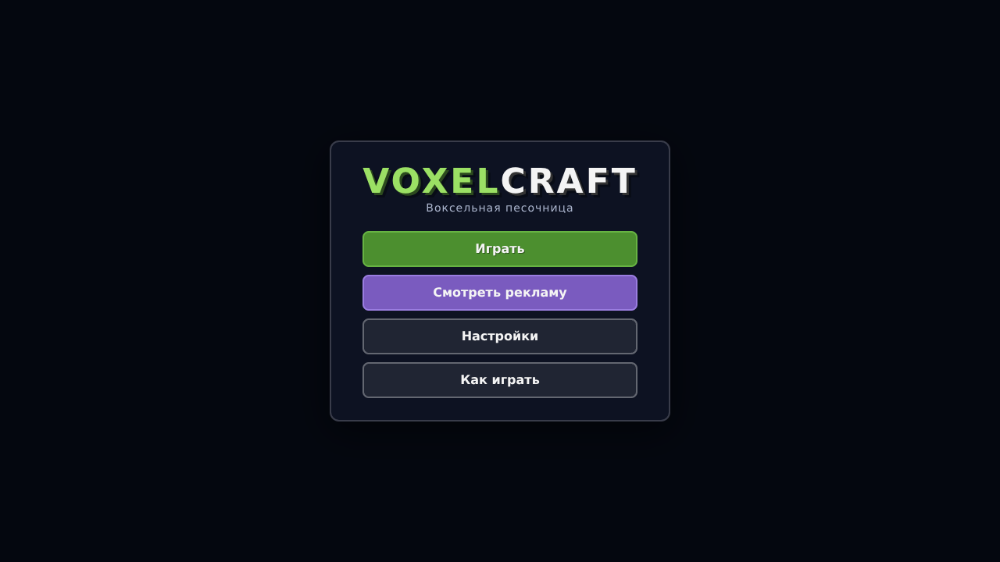
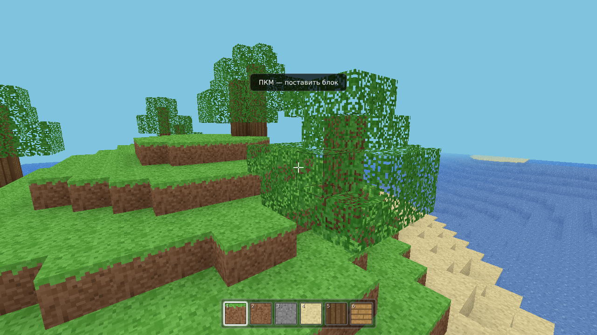
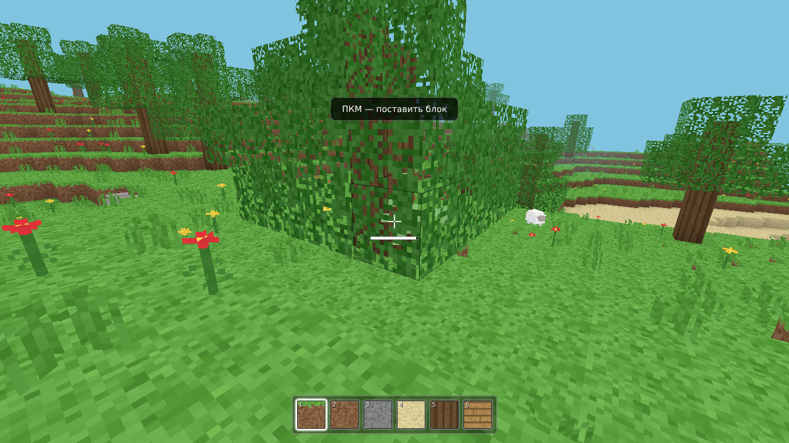

# VoxelCraft — воксельная песочница для Яндекс Игр

Оригинальная воксельная игра в жанре «песочница с блоками»: процедурный мир, разрушение и
установка блоков, два режима игры (выживание и креатив), инвентарь на 36 ячеек с крафтом,
мобы, смена дня и ночи, сохранение прогресса. Все текстуры, иконки и звуки генерируются
процедурно — никаких сторонних ассетов; фоновую музыку можно положить в папку `music/`.

Игра полностью готова к публикации на **Яндекс Играх**: работает на ПК и телефонах,
интегрирована с SDK (сохранения в облаке, реклама с вознаграждением, межстраничная реклама,
GameplayAPI/LoadingAPI, локализация ru/en).





## Возможности

- 🎮 **Режимы и сложности:** выживание/креатив, мирная/лёгкая/обычная/сложная; параметры сохраняются в каждом мире
- 🌍 **Несколько миров:** создание с именем и сидом, список, загрузка, удаление и миграция старого сохранения
- 🎒 **Инвентарь на 36 ячеек** (первые 9 — хотбар): стопки до 64, инструменты по 1, предмет «в руке» за курсором, ЛКМ/ПКМ как в классических песочницах
- 🖱 **Перетаскивание мышью:** стопку можно не только брать кликом, но и **тащить** между ячейками — при отпускании она кладётся в новую клетку (или меняется с содержимым), а зажатая кнопка с протяжкой раскладывает предметы по клеткам сетки крафта
- ⚒ **42 рецепта:** сетка 2×2 в инвентаре, **верстак** для 3×3, **печь** для плавки и **наковальня** для металлического инструмента; описания предметов доступны в списке и подсказках
- 🔨 **Наковальня:** железные, золотые и алмазные кирка/топор/меч (9 рецептов) куются только на ней; сама наковальня крафтится из 4 слитков железа, 2 углей и 2 досок
- 🥷 **Приседание (Shift):** игрок становится ниже (1.5 блока вместо 1.8), смотрит с высоты 1.28, идёт медленнее и **не падает с края**, пока не выйдет за границу блока; присед позволяет безопасно строить над пропастью, а автоподъём на плиту/ступеньку при этом сохраняется
- 🎵 **Фоновая музыка:** треки из папки `music/` играют во время геймплея и плавно затихают в меню, паузе и инвентаре; включается чекбоксом «Музыка» в настройках
- 🙌 **Предмет в руке:** блок — объёмный кубик с настоящими текстурами атласа, инструменты, палка и стрела — объёмный пиксель-арт, выдавленный из той же картинки, что и иконка в инвентаре (модель в руке совпадает с иконкой), яблоко — 3D-модель, лук — дуга с тетивой, которая натягивается при выстреле
- 🧰 **Инструменты:** кирка ускоряет добычу камня (дерево ×0.85, камень ×0.55, без кирки ×2.6), топор — дерева (×0.5, без топора ×1.6), мечи наносят 2–3 урона вместо 1
- 🔦 **Факелы:** объёмная модель и пламя со свечением; ставятся на пол и на любую из четырёх стен (своя модель для каждой стороны, наклон от стены); рядом с факелом освещаются пещеры, вдали без источников остаётся темно; **факел в руке светит так же, как поставленный** — свет движется вместе с игроком. Свет факелов не зависит от времени суток: ночью яркий, днём не пересвечивает
- 🌗 **Мягкий свет в пещерах:** дневной свет затекает в пещеру и огибает углы, затухая постепенно (20 уровней вместо резкого обрыва), тени сглажены между вершинами и через границы чанков
- 🌳 **Плотная листва:** внутри кроны грани между блоками листвы отрисовываются плотной текстурой без просветов — дерево не просвечивает насквозь, по краям листва остаётся ажурной
- 🍎 **Еда:** съедобный предмет в руке — удерживайте ЛКМ (или палец на телефоне), и персонаж подносит еду ко рту, жуёт с хрустом и крошками, а досыта поев, довольно отрыгивает; отпустили раньше — предмет не тратится, здоровье прибавляется только за полное поедание
- 🏹 **Лук и стрелы:** удерживайте ПКМ — тетива натягивается (до 0.85 с), отпустите — выстрел; сила и урон (1–6) зависят от натяжения, стрела летит по дуге, втыкается в блоки и подбирается обратно, попадает в мобов
- 🔫 **Пистолет:** 3 слитка + 2 доски + палка на верстаке; удерживайте ПКМ — выстрелы очередью (0.36 с между выстрелами), патроны крафтятся из слитка и угля (1 → 8). Урон 5, пуля летит почти прямо и гаснет в первом блоке, у дула — вспышка, отдача и дым, в HUD — счётчик патронов
- 🌍 Процедурный бесконечный мир: холмы, горы с каменными хребтами и снежными вершинами, пляжи, вода и деревья; встречаются ступенчатые карьеры и извилистые разломы
- 🕳 **Пещеры:** отдельные извилистые ходы-«черви» разной ширины, которые уходят вглубь почти до сланцевого дна и поднимаются к поверхности, сужаются, ветвятся и заканчиваются тупиками; подземные залы, лазы с поверхности, сталактиты и сталагмиты, гравий, мох на стенах и руды в камне
- 🪨 Растения и факелы ломаются при удалении опоры; предметы выпадают физически, лежат и вращаются, притягиваются только поблизости и подбираются вблизи игрока
- 🎬 **Живые анимации мобов:** лапы ходят диагональными парами (у паука волна по восьмём ногам), голова поворачивается к игроку, хвост виляет на спокойной ходьбе и вытягивается в погоне, уши прижимаются в ярости, мобы мигают, дышат в покое и делают выпад вперёд при атаке
- 🧟 Ночью появляются обычные гуманоидные **зомби**: они преследуют игрока по земле, атакуют вблизи и сгорают на рассвете; у мобов выразительные лица и анимации
- 🕷 **Пауки** выходят ночью и кусают, **криперы** подкрадываются и взрываются (с шипением и разрушением блоков), в воде плавает **рыба**, по земле рыщут **волки**: раненый волк впадает в ярость и гонится за обидчиком
- 🕊 Птицы больше не неуязвимы: их можно поразить и сбить в полёте
- 🎁 **Дроп с мобов:** с овцы падают шерсть и сырое мясо, с волка — мясо и **клык** (задел под будущие крафты), с зайца и птицы — мясо, с зомби — мясо и иногда слиток железа, с паука — палки и клык, с крипера — уголь, со слизня — палка; в креативе лут не выпадает
- 🌀 **Мобы больше не «крутятся на месте»:** упёршийся в блок или обрыв моб запоминает, что не двигается, выбирает один свободный курс (в том числе «назад») и идёт по нему секунду-другую, пока не освободится; если идти совсем некуда — просто стоит, а не вертится каждый кадр
- 🔥 **Плавильная печь:** ПКМ по печи открывает интерфейс с отдельными слотами сырья, топлива и результата; плавка сохраняется по координатам блока
- 📦 **Сундуки:** 27 ячеек, ставятся лицевой стороной к игроку, содержимое сохраняется по координатам блока; при разрушении сундука (или печи, в т.ч. взрывом крипера) содержимое выпадает
- ⇧ **Быстрое перемещение Shift+клик:** пока открыт сундук, печь или верстак, стопка уходит именно туда (сырьё — в слот сырья, топливо — в слот топлива); Shift+клик по слотам станка возвращает её в инвентарь, по результату крафта — крафтит всю доступную стопку. **Если станок не открыт**, Shift+клик перекладывает стопку между хотбаром и рюкзаком — и только туда, ничего не «съедая»
- 💀 **Анимация смерти:** убитый моб не исчезает мгновенно — заваливается набок, оседает, уменьшается и рассыпается частицами
- ⛏ **Руды стало заметно больше:** жилы считаются от поверхности, а не от дна мира, поэтому уголь и железо лежат у самой поверхности и видны в скалах и обрывах — первые руды находятся за несколько шагов, а не после долгих раскопок
- 🧱 Больше 50 типов блоков (с вариантами сторон и половинок): руды (уголь, железо, золото, алмаз), гравий, песчаник, лёд, мшистый камень, обсидиан, берёза, ель, кактус, деревянные и каменные плиты, **забор**, **наковальня**, **берёзовые доски**, верстак, печь и сундук; хотбар с выбором колесом/цифрами/тапом
- 🧩 **Плиты без дыр:** текстура плиты больше не «полупрозрачная» и не рвётся — боковые грани берут свою половину тайла, верхняя плита использует верхнюю половину, верх и низ показывают свою текстуру, выпавшая плита — настоящий полблок; сетка трещин при ломании повторяет форму плиты, а не полного куба
- 🧱 **Две плиты = полный блок:** если поставить вторую половину в ту же клетку (верхнюю плиту на нижнюю или наоборот), они складываются в целый блок
- 🚧 **Забор с 3D-моделью:** столб 3/8×1½ блока обшит текстурой со всех четырёх сторон, сверху и снизу, плюс по две перекладины к каждому соседу-забору и полному блоку; свои текстуры столба и перекладины, выпавшая модель тоже объёмная
- 🌳 **Большие деревья:** изредка вырастают высокие стволы (9–16 блоков) с широкой кроной — как лиственные, так и ели; берёза получила аккуратную светлую текстуру с тёмными чёрточками, все цвета текстур чуть приглушены для реализма
- 🌿 Декоративная трава, папоротник, клевер и цветы
- 🌦 Погода: дождь идёт реже, снегопад и гроза со звуками; молния ударяет в отдельную точку мира, а не засвечивает экран целиком
- ⛏ Разрушение с анимацией трещин (5 стадий) и пылью, частицы, процедурные звуки
- 💥 При длительном беге камера плавно раскачивается с нарастающей силой; причина гибели выводится сообщением
- 💥 Анимация урона: красная вспышка на весь экран, тряска камеры и интерфейса, мигание сердечек; мобы на 0.3 с становятся красными, отлетают назад (не сквозь блоки), пищат и сыплют красными частицами
- 🛡 **Нет «удара из меню»:** после Esc, паузы и возврата из меню/инвентаря игрок получает ~0.7 с неуязвимости — вспышка урона больше не срабатывает просто от выхода из меню
- 🕊 Полёт (в креативе): двойной пробел / кнопка
- 🌅 Полный цикл дня и ночи со звёздами, солнцем и луной
- 🖥 **Полный экран и Ctrl+W:** в полном экране игра перехватывает клавиши (Ctrl+W не закрывает вкладку), Esc открывает паузу, а не выкидывает из игры
- 💾 Автосохранение мира и построек (облако Яндекса или localStorage), лидерборд «Построено блоков»
- 📱 Сенсорное управление: джойстик, обзор свайпом, кнопки действий
- 🎁 Реклама за вознаграждение — «Набор строителя» с декоративными блоками (доступны в креативе и крафтятся в выживании)
- 🖼 Иконки предметов: объёмные изометрические кубики из атласа текстур, плоские спрайты растений, пиксель-арт инструментов
- 🌐 Локализация русский/английский

## Крафт

| Где | Что доступно |
|---|---|
| Сетка **2×2** в окне инвентаря (E) | бревно → доски, **берёзовое бревно → берёзовые доски**, палки, стрелы, светокамень, снег, 2 доски/булыжника → 4 плиты, уголь + палка → 4 факела, 4 доски → **верстак** |
| **Верстак** (поставить блок и нажать ПКМ) — сетка 3×3 | деревянные и каменные инструменты, **лук**, **пистолет** (3 слитка + 2 доски + палка), **патроны** (слиток + уголь → 8), печь, **сундук** (8 досок кольцом), **забор** (доски + палки), **наковальня** (4 слитка железа + 2 угля + 2 доски), хлеб, кирпич, камень, сланец, стекло |
| **Наковальня** (поставить блок и нажать ПКМ) | **железные, золотые и алмазные** кирка, топор и меч — 9 рецептов; без наковальни они недоступны и помечены в списке |
| **Печь** (ПКМ) | плавка: сырое железо/золото → слитки, песок → стекло, булыжник → камень |
| Список рецептов слева | доступные подсвечены зелёным, клик — быстрый крафт (рецепты 3×3 помечены «3×3», требующие станка — значком); описания видны в списке и подсказках |

**Золото и алмазы больше не «мёртвый груз»:** самородки/слитки и алмазы имеют рабочие рецепты
(золотые и алмазные инструменты на наковальне), а их иконки корректно рисуются в инвентаре, хотбаре
и в предмете в руке.

В сетке: ЛКМ — положить/забрать стопку, ПКМ — по одному. **Зажатая кнопка + протяжка по клеткам**
раскладывает по одному предмету в каждую клетку, через которую провели курсор — как в Minecraft.
Результат — справа от сетки: клик забирает один крафт, ПКМ — скрафтить всю стопку.
**Shift+клик** по результату крафтит сразу всё, на что хватает ингредиентов; Shift+клик по клетке сетки возвращает её в инвентарь.
Содержимое сетки возвращается в инвентарь при закрытии окна.

## Плавка

Поставьте печь и нажмите по ней **ПКМ**. Переместите сырьё и топливо из инвентаря в отдельные слоты;
готовый результат забирается справа. В печи можно переплавить сырое железо и золото в слитки,
песок — в стекло, булыжник — в камень. Топливо: уголь, палки, доски и брёвна. Прогресс и содержимое
каждой печи сохраняются отдельно по её координатам. **Shift+клик** по предмету в инвентаре сам раскладывает его: руду — в сырьё, уголь/дерево — в топливо.

## Сундуки

Сундук крафтится на верстаке из 8 досок (кольцом, центр пустой) и ставится лицом к игроку. ПКМ открывает
27 ячеек над инвентарём. Предметы перекладываются мышью или **Shift+кликом** (в обе стороны).
Содержимое сохраняется вместе с миром; если сундук сломать, всё выпадет на землю.
Чтобы поставить блок вплотную к сундуку, верстаку или печи, не открывая их, держите **Shift**.

## Режимы игры

| | Выживание | Креатив |
|---|---|---|
| Сломанный блок | выпадает физическим предметом (трава → земля, камень → булыжник, стекло — ничего); подобрать можно рядом | исчезает |
| Постановка блока | расходует предмет из инвентаря | бесконечные блоки (значок ∞) |
| Скорость ломания | зависит от инструмента | ~0.12 с для любого блока |
| Полёт | нет | двойной пробел |
| Урон, голод-здоровье | мобы наносят урон, сердечки видны | игрок бессмертен, сердечки скрыты |
| Каталог блоков | нет, только крафт | есть, слева в окне инвентаря |

В форме создания мира задаются название, сид, режим и сложность. В списке можно загружать и удалять миры;
режим и сложность сохраняются отдельно для каждого мира. Режим также можно переключить на паузе — селект
применяется сразу (полёт, бессмертие, дроп блоков, сердечки, кнопка «🕊» и сохранение мира обновляются
на месте), а не только после пересоздания мира. Выбор режима в меню подставляется в форму создания мира.
Старые одиночные сохранения автоматически переносятся в список миров.

Клавиша **F** теперь только съедает яблоко — в режим полёта переводит двойное нажатие пробела (креатив).

## Музыка

Игра не содержит звуковых файлов — положите свои треки в папку **`music/`** рядом с `index.html`:

```
music/music1.mp3   music/music2.mp3   music/music3.mp3   music/music4.mp3
music/theme.mp3    (то же самое в .ogg)
```

Найденные файлы собираются в плейлист: один трек играет по кругу, несколько — переключаются
в случайном порядке. Музыка звучит в состоянии «геймплей» и плавно затихает в меню, паузе и
инвентаре; громкость — половина общей громкости игры. Чекбокс **«Музыка»** в настройках и общий
выключатель звука сохраняются вместе с остальными настройками. Если папка пуста — просто тишина,
игра остаётся полностью офлайновой. `npm run zip` кладёт папку `music/` в архив для Яндекс Игр.

## Как запустить

### Локально

```bash
git clone https://github.com/xisscag-ops/voxelcraft-yandex.git
cd voxelcraft-yandex
npm install        # three + esbuild
npm run build      # собрать game.js из src/
npm run serve      # http://localhost:8080
```

Откройте `http://localhost:8080` в браузере. Для разработки удобнее `npm run dev`
(сборка без минификации, с sourcemap) и `npm test` (смоук-тесты логики).

### Через GitHub Pages

1. Запушьте собранный `game.js` (после `npm run build`) в ветку `main`.
2. Откройте репозиторий → **Settings** → **Pages**.
3. В блоке **Build and deployment** выберите Source: **Deploy from a branch**.
4. Укажите ветку **`main`** и папку **`/ (root)`**, нажмите **Save**.
5. Через минуту игра будет доступна по адресу `https://xisscag-ops.github.io/voxelcraft-yandex/`.

`index.html`, `styles.css` и `game.js` лежат в корне репозитория — этого достаточно для Pages.

## Сборка и тесты

```bash
npm install        # зависимости (three, esbuild)
npm run build      # собрать game.js (его использует GitHub Pages и Яндекс Игры)
npm run serve      # локальный сервер на http://localhost:8080
npm run zip        # собрать game.js + voxelcraft-yandex.zip для загрузки в консоль
npm test           # смоук-тесты: мир, мешер, рейкаст, инвентарь, крафт, инструменты, дроп
npm run dev        # сборка для разработки (без минификации, с sourcemap)
```

## Публикация на Яндекс Играх

1. Выполните `npm run zip` — получится `voxelcraft-yandex.zip`.
2. Откройте [Консоль разработчика Яндекс Игр](https://games.yandex.ru/console) → «Создать игру».
3. Загрузите архив (`index.html`, `styles.css`, `game.js` в корне и папка `music/` — уже включены).
4. Заполните карточку игры (название, описание, категория «Песочницы»/«Аркады»,
   ориентация — **альбомная**, устройства — телефон + компьютер).
5. Проверьте игру в черновике (песочница консоли), затем отправьте на модерацию.

Что уже сделано под требования платформы:

- вызовы `LoadingAPI.ready()` и `GameplayAPI.start()/stop()` (старт/остановка геймплея);
- `showFullscreenAdv` при выходе в меню после игры и `showRewardedVideo` для бонуса;
- пауза и приглушение звука при сворачивании вкладки/экрана и на время рекламы;
- игра не падает без интернета к SDK (локальный фолбэк на localStorage);
- альбомная ориентация с подсказкой поворота экрана на телефоне;
- весь код и ассеты внутри архива, внешних загрузок (шрифты/картинки) нет.

## Управление

| ПК | Телефон |
|----|---------|
| WASD — движение | Джойстик слева |
| Мышь — обзор | Свайп справа — обзор |
| ЛКМ (удерживать) — сломать | Тап по экрану — сломать |
| ЛКМ (удерживать) с едой в руке — съесть | Удерживать палец с едой в руке |
| ПКМ — поставить/использовать блок (печь открывает плавку, сундук — хранилище; с Shift — просто поставить блок рядом; лук — удержать и отпустить для выстрела; пистолет — удержать для стрельбы) | Кнопка «🧱» — поставить/использовать блок (с пистолетом в руке стреляет) |
| E — инвентарь и крафт | Кнопка «🎒» |
| ЛКМ — удар по мобу | Тап — удар/сломать |
| ЛКМ по слоту с зажатой кнопкой — разложить предметы по клеткам | То же пальцем |
| Shift+клик по слоту — быстро перенести стопку (в открытый сундук/печь/верстак, иначе между хотбаром и рюкзаком) | — |
| Перетаскивание стопки мышью между ячейками | То же пальцем |
| Shift — приседание (не падаете с края, идёте медленнее) | — |
| F — съесть яблоко | — |
| 1–9 / колесо — выбор слота | Тап по слоту хотбара |
| Прыжок — пробел | Кнопка «▲» |
| Бег — Ctrl | Джойстик до упора |
| Закрыть инвентарь — E / Esc | Кнопка «✕» |
| Полёт — двойной пробел (креатив) | Кнопка «🕊» (креатив) |
| Пауза — Esc | Кнопка «⏸» |

## Структура проекта

```
index.html         # разметка и экраны UI
styles.css         # стили интерфейса
game.js            # собранный бандл (npm run build)
smoke-test.mjs     # смоук-тесты логики (npm test)
music/             # сюда кладите свои треки (см. music/README.txt)
src/
  main.js          # игровой цикл, состояния, связка модулей
  config.js        # константы
  world.js         # чанки, рельеф, пещеры, карьеры и разломы
  mesher.js        # меширование вокселей + ambient occlusion
  mobs.js          # мобы: модели, ИИ, анимации
  blocks.js        # типы блоков (в т.ч. класс инструмента для каждого)
  items.js         # реестр предметов, описания, дропы и время ломания
  furnace.js       # рецепты плавки, топливо и сохранение печей
  chest.js         # сундуки: 27 ячеек и сохранение содержимого
  inventory.js     # инвентарь: 36 ячеек, стопки, сериализация
  crafts.js        # рецепты крафта, проверка доступности и выполнение
  inventory-ui.js  # окно инвентаря, список рецептов, подсказки, интерфейс печи и сундука, Shift+клик
  icons.js         # иконки: изометрические кубики, спрайты, пиксель-арт
  textures.js      # процедурный атлас текстур
  physics.js       # физика игрока
  raycast.js       # DDA-рейкаст по блокам
  sky.js           # день/ночь, небо, солнце и луна
  particles.js     # частицы разрушения
  projectiles.js   # стрелы: полёт, попадания, подбор
  eating.js        # поедание еды удержанием кнопки (логика и анимация)
  weather.js       # дождь, снег, гроза
  audio.js         # процедурные звуки (WebAudio)
  music.js         # фоновая музыка: поиск треков в music/, плейлист, затухание
  input.js         # клавиатура/мышь/тач
  ui.js            # HUD, хотбар, меню
  i18n.js          # локализация
  ysdk.js          # обёртка SDK Яндекс Игр
```

## Юридическое

VoxelCraft — самостоятельная игра. Механики жанра (блоки, строительство) не защищены
авторским правом, но код, текстуры, звуки, название и тексты здесь оригинальные и не
используют материалы Mojang/Microsoft. Не называйте игру «Minecraft» и не копируйте
ассеты оригинала.

## Выживание
- ❤️ Здоровье (10 сердец) и урон от падений; медленная регенерация; в креативе сердечки скрыты, а урон не проходит
- 🌑 Ночные **зомби**, пауки и криперы преследуют и атакуют; зомби сгорают на рассвете
- 🐇 Мобы с уроном: бить можно всех, включая птиц; зайцы и овцы выдерживают 2–3 удара, после удара
  краснеют на 0.3 с, отлетают назад и убегают
- 🕷 Ночью выходят пауки и криперы, в воде плавает рыба, волки рыщут по земле: раненый волк становится злее
- 🔫 Пистолет доступен в креативе в каталоге предметов, в выживании крафтится на верстаке
- 🏹 В начале выживания выдаются лук и 16 стрел — стрелы подбираются с земли и с воткнувшихся в блоки
- 🍎 Яблоки иногда падают с листвы и с мобов: удерживайте **ЛКМ** с яблоком в руке, чтобы съесть его с анимацией (+2 сердца), или нажмите **F** — съест сразу
- 🕳 Пещеры можно найти по лазам с поверхности: вниз ведут тоннели и залы, там встречаются руды и натёки
- 🎒 Сломанные блоки складываются в инвентарь и тратятся при установке — стройте из того, что добыли
- 🎁 С убитых мобов падает лут: шерсть и мясо с овцы, мясо и клык с волка, уголь с крипера (подбирается вблизи)
- 🥷 **Shift** — присед: ниже рост, медленнее шаг и страховка от падения с края; стройте мосты над пропастью спокойно
- 🔨 Металлический инструмент (железо, золото, алмаз) куется только на **наковальне** — найдите железо и уголь
